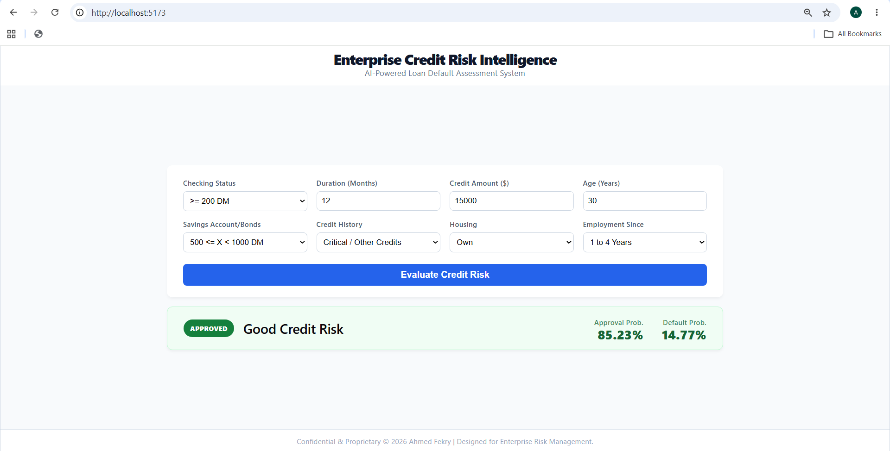
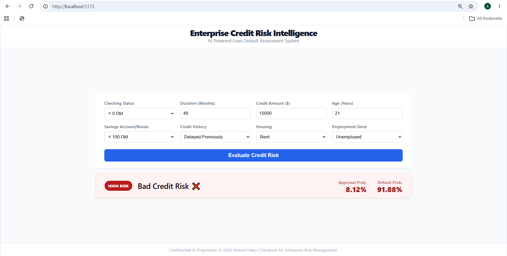

#  Enterprise Credit Risk Intelligence System

An end-to-end, AI-powered credit risk assessment platform designed to evaluate bank loan applications, predict default probabilities, and assist financial institutions in real-time decision-making. Built with a robust Machine Learning pipeline, a high-performance FastAPI backend, and a modern React enterprise dashboard.

---

##  System Previews



*Figure 1: Approved Application — Evaluating a low-risk financial profile resulting in a Good Credit Risk classification.*


*Figure 2: Flagged High-Risk Application — Detecting default potential (young age, large loan amount, long duration, unestablished savings) and triggering a High Risk alert.*

---

##  Project Overview & Business Value
Financial institutions face significant losses due to loan defaults. This system automates the risk assessment process by analyzing 20 financial and demographic factors of an applicant (such as credit history, housing, employment, and loan duration) to instantly classify the application as **Approved (Good Credit)** or **High Risk (Bad Credit)** with precise confidence probabilities.

---

##  Machine Learning Pipeline & Optimization

### 1. The Dataset
The model was trained on the renowned **UCI Statlog (German Credit Data)** dataset, comprising 1000 instances with 20 categorical and numerical attributes.
* **Challenge:** The dataset was highly imbalanced (70% Good Credit, 30% Bad Credit).

### 2. Preprocessing & Feature Engineering
* Handled missing/implicit values and standardized categorical features.
* Applied **One-Hot Encoding** (`pd.get_dummies`), expanding the 20 raw features into **48 precise numerical features**.
* Applied `StandardScaler` to normalize numeric distributions (e.g., Credit Amount, Age, Duration).

### 3. Algorithm Selection & Optimization
We evaluated several algorithms. Our primary metric was **Recall for the Minority Class (Bad Credit)**, because the financial cost of approving a bad loan (False Positive) is vastly higher than rejecting a good one (False Negative).

* **Before Optimization (Imbalanced Data):**
  Standard models (like default Random Forest or basic Logistic Regression) achieved high overall accuracy (~75%) but had a dangerously low Recall for Bad Credit (~30-40%). They were biased towards approving almost everyone.

* **After Optimization (SMOTE + Class Weights):**
  We applied **SMOTE (Syntheticেম Synthetic Minority Over-sampling Technique)** exclusively on the training set to synthetically balance the classes, alongside tuning `class_weight='balanced'`.

* **The Chosen Model: Logistic Regression**
  * *Why?* After SMOTE, Logistic Regression outperformed complex models like Random Forest and XGBoost in terms of **Interpretability** and **Recall**. Banks require explainable AI, and Logistic Regression provides clear probability scores without the "black-box" effect.
  * *Results:* The model successfully learned to penalize high-risk profiles (e.g., young age + large loan amount + long duration), increasing the Bad Credit Recall significantly and protecting the institution's assets.

---

##  Backend Engineering (FastAPI)
The inference engine was built using **FastAPI** to ensure lightning-fast, production-ready performance. 

* **The Schema Alignment Architecture:** 
  A common pitfall in ML deployment is the `get_dummies` single-row inconsistency during inference. We engineered a **Static Feature Mapping Layer** in the API:
  1. The API receives the frontend inputs.
  2. It initializes a zero-matrix DataFrame strictly matching the **48 expected columns** from the trained `scaler.feature_names_in_`.
  3. It dynamically maps the user's categorical inputs to their correct One-Hot encoded column names.
  4. This guarantees 100% schema alignment between the React frontend and the Scikit-Learn model, ensuring accurate predictions and resolving fixed-probability bugs.

---

##  Frontend Engineering (React + Vite)
The user interface was designed to simulate a real-world **Internal Banking ERP System**.

* **Tech Stack:** React (bootstrapped with Vite for optimal speed) and Axios for seamless API communication.
* **Enterprise UI/UX:** 
  * Designed a **Single-Viewport, Scroll-Free** layout utilizing `100vh` and precise grid structures.
  * Built a **4-Column Data Grid** to condense complex financial inputs intelligently.
  * Implemented a dynamic **Horizontal Result Banner** that updates instantly based on the API response, displaying the final decision and exact probability metrics using clean, conditional styling (Glassmorphism & distinct Green/Red status indicators).

---

##  Full Tech Stack

| Domain | Technologies Used |
| :--- | :--- |
| **Machine Learning** | Python, Scikit-Learn, Pandas, NumPy, Imbalanced-Learn (SMOTE), Joblib |
| **Backend API** | FastAPI, Uvicorn, Pydantic, CORS Middleware |
| **Frontend UI** | React, Vite, Axios, Modern CSS3 (CSS Variables, Flexbox, Grid) |
| **Version Control** | Git & GitHub |

---
## Project Structure

```text
Credit_Risk_Project/
│
├── api/
│   └── main.py              # FastAPI server & static feature mapping layer
├── data/
│   └── raw/
│       └── German_Credit_Data.csv # Original UCI dataset
├── models/
│   ├── logistic_model.pkl   # Serialized optimized model
│   └── scaler.pkl           # Serialized standard scaler
├── src/
│   ├── preprocessing.py     # Data cleaning & SMOTE pipeline
│   └── model_training.py    # Training & evaluation scripts
├── frontend/
│   ├── src/
│   │   ├── App.jsx          # React Dashboard Component (Split/Grid View)
│   │   └── App.css          # Enterprise UI styling (No-scroll layout)
│   └── package.json
├── main.py                  # Pipeline execution script
└── requirements.txt         # Python dependencies
